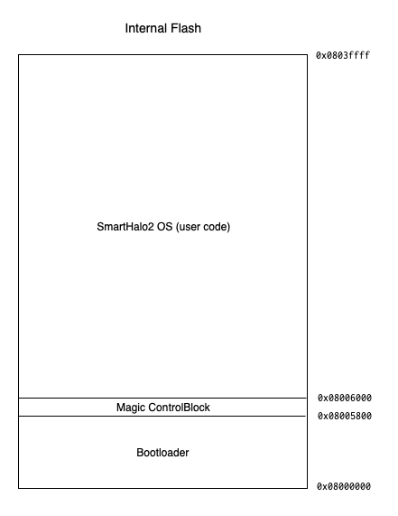
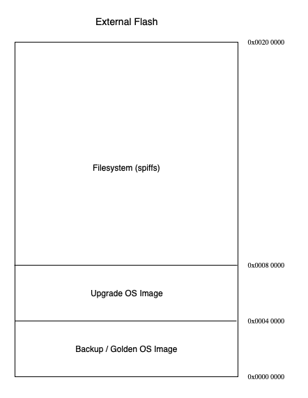

# Smarthalo2 Bootloader

## Overview

After reset (or powerup) the first thing the SmartHalo2 runs is the bootloader. The bootloader is a small program with several main responsibilities:

1. boot into the current firmware resident in the internal flash
2. install a firmware update from the external flash onto the internal flash (and reboot into it)
3. on certain conditions, re-install a backup firmware image (and reboot into it)

There is an additional "manufacturing" mode described below.

## Memory Maps

 

N.B. The external flash is not memory mapped, meaning that the addresses are
on this map are physical addresses or offsets into the flash. These offsets
are not part of the address space of the MCU.

## Details

### Magic Control Block (MCB)

The MCB is located on the internal flash at address `0x8005800`.

Offset | Description
------ | -----------
0x00 | First boot flags (`0xffffffff` means first boot)
0x04 | CRC32 of the internal flash image
0x08 | length of the internal flash image
0x0c | CRC32 of the external flash backup/golden image
0x10 | length of the external flash backup/golden region
0x14 | CRC32 of the external flash update region
0x18 | length of the external flash update image
0x1c | Pointer to bootloader version number (major.minor.revision.commit)
0x20 | Serial # (12 bytes -- 8 bytes of serial and 4 NULL bytes)

Addtional notes:

* this layout is described by the `mcb_t` structure in `mcb.h`
* byte-order is machine native (little-endian)

### Bootloder / SH2 OS Shared Variables

The linker map script for both the bootloader and SmartHalo2 OS contain
several symbol definitions in SRAM. All of these locations share the property
that they are _not_ reset across reboots:

Variable | Address | Description
:------- | :------ | :----------
`__boot_reason__` | 0x20027ffc | reboot reason, as discovered by examine processor flags
`__boot_flags__` | 0x20027ff8 | used for signaling information between the bootloader and the OS _See BootFlags in Boot.h_
`__update_crc__` | 0x20027ff4 | CRC32 of the firmware update, set by SH2OS and consumed/reset by bootloader
`__update_len__` | 0x20027ff0 | length of the firmware update, set by SH2OS and consumed/reset by bootloader

### Boot Sequence

The boot sequence is affected by a BootFlags structure which has several flags:

Flag           | Description
:---           | :----------
halt           | do not boot, go into low-power standby mode
forceGolden    | re-install golden/backup firmware and reboot
ignoreWatchdog | if the device is booting after a watchdog reset, do not re-install golden
normalReboot   | the device was intentionally rebooted by the firmware

16 bits of this structure are devoted to a key. If those bits do not match the
key, then the structure is reinitialized (and the flags are ignored)

#### Normal Boot

The device was reset by software and the `normalReboot` flag is set then:

1. Check the halt flag and maybe go into low-power standby mode.
2. Fall through.

#### Software/FW Crash Boot

The device was reset by software and the `normalReboot` flag is not set, then
the bootloader assumes the firmware crashed and _halts the device_ (discuss)

#### Re-install backup/golden firmware image

In the event that the device was reset by the hardware watchdog *OR* with the
`forceGolden` flag set:

1. Copy the backup/golden image from the external to the internal flash.
2. Verify the CRC
3. Update the MCB
4. Reboot the device

If the `ignoreWatchdog` flag is set, this block is skipped. The FW will set this
flag automatically after the device has been up and running for XXX time.

#### Install Update

The bootloader checks `__update_crc__` and `__update_len__` to determine that
there is an update available.

1. Copy the update image from the external to the internal flash
2. Verify the CRC
3. Reset the `__update_*__` variables
4. Update the MCB
5. Reboot the device

SmartHalo2 OS receives firmware updates from the app, writing them into the
update area of the external flash. After which, SH2OS will:

1. Update the metadata (crc and length) for the update image in RAM
(`__update_crc__` and `__update_len__`)
2. Reboot the device

#### Boot Internal Flash Image (normal case)

1. Check CRC of internal flash image.
2. Jump to entry point of firmware image located at 0x08006000

#### Pathological Case

All of the previous failed to successfully boot.

1. Attempt to re-install and boot the image in the update area.
2. Attempt to re-install and boot the image in the golden/backup area.
3. Halt.

### Manufacturing Mode

The external flash is not a memory mapped device and as such cannot be
pre-programmed with a JTAG debugger in the manufacturing process. The proposal
is to package both the bootloader and the golden firmware (as well as the
correct CRC(s) in the MCB) in a single binary image file that matches the
internal flash memory map. The manufacturing house will be able to flash this
image prior to sealing units. See `scripts/flashit` for an example script.

On first boot, the bootloader will check a first boot flag (in the MCB) and
copy the golden image from the internal flash to the backup region on the
external flash. This operation only happens one time in the life of a unit.

After this operation is complete, the device is halted (put into a low power
shutdown mode).

### Halt / Shutdown

During halt, the bootloader configures the processor to keep several enable
pins low (these pins are connected to VDOs supplying power to peripherals).

This configuration must be done prior to shutting down the processor otherwise
the peripherals will continue to draw power and drain the battery.

#### Architectural Note About Shutdown

When the firmware wants to halt the device, it sets the halt boot flag and
reboots. It is the bootloader that sees this flag and handles the details.

The primary reason for having the bootloader handle this function is the
watchdog. If the firmware simply halts the device, then the watchdog will
expire and reset the device -- which can trigger the re-install golden logic.

### Watchdog

Normally, bootloader will start the hardware watchdog before launching the
firmware. This can be disabled by setting the `disableWatchdog` boot flag. It
is expected that the firmware may do this at some future time (when it
"decides" that it no longer needs watchdog protection).

However, after a firmware update, the bootloader will unset this flag.
